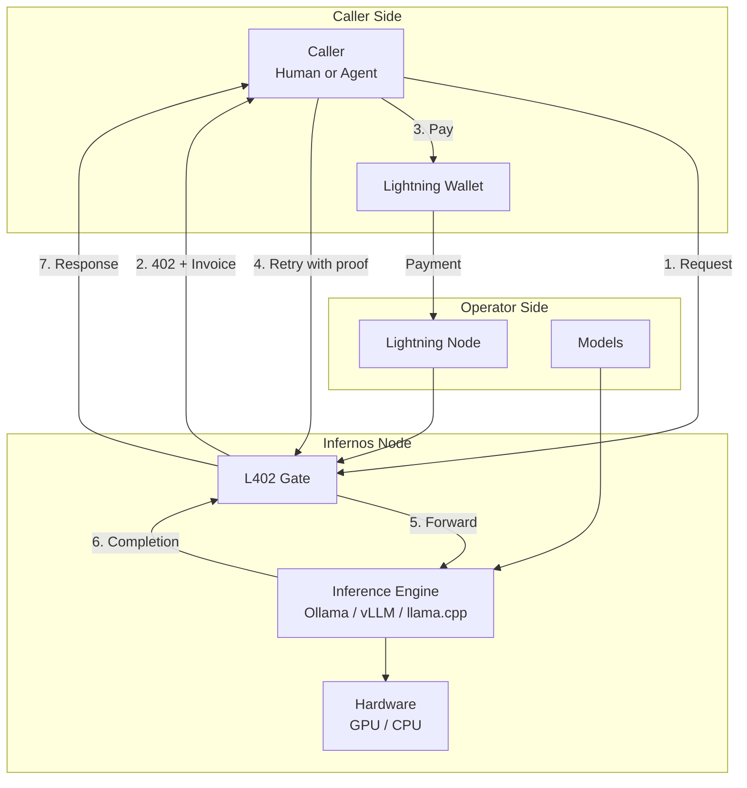

# Infernos

**Permissionless Open-Model Inference Paid in Sats**

[](https://github.com/infernos-ai/infernos/actions/workflows/ci.yml)
[](https://opensource.org/licenses/MIT)

Infernos turns any machine running open-weight AI models into a self-sovereign, paid inference endpoint. Anyone can operate an Infernos node to monetize compute in Satoshis. Any autonomous agent or user can consume inference securely without accounts, subscriptions, API keys, or identity disclosures using cryptographic L402 payment authorization.

---

## Key Features

- **Self-Sovereign Operator Nodes**: Run open-weight models on your own hardware via Ollama or any OpenAI-compatible engine.
- **Permissionless L402 Payments**: Access inference on a per-request or per-token basis authenticated via Lightning Network preimages and macaroons.
- **Session Budgets**: Strict, enforceable expenditure limits for multi-step agent workflows.
- **Privacy by Default**: Zero prompt logging. Prompts and completions are never persisted or exposed in logs.
- **OpenAI-Compatible Surface**: Seamless drop-in compatibility with standard tooling, SDKs, and autonomous agent frameworks.

---

## Architecture Overview



---

## Quick Start

### 1. Build and Run

```bash
# Clone the repository
git clone https://github.com/infernos-ai/infernos.git
cd infernos

# Check and build with Cargo
cargo build --release
```

### 2. Run Operator Node

```bash
# Start the node with configuration
cargo run -- node start --config config/node.example.toml
```

### 3. Make an Inference Call

```bash
# Query the node as a caller
cargo run -- call --endpoint http://127.0.0.1:8080 --model llama3 --prompt "Explain the Lightning Network"
```

---

## Documentation

- [Architecture & System Design](docs/architecture.md)
- [Operator Guide](docs/node-guide.md)
- [Caller & Agent Guide](docs/caller-guide.md)
- [L402 & Payment Protocol](docs/l402-and-payments.md)
- [Session Budgets](docs/session-budgets.md)
- [Privacy Model & Guarantees](docs/privacy.md)
- [Development & Contributing](docs/development.md)

---

## License

Licensed under the MIT License ([LICENSE](LICENSE)).
